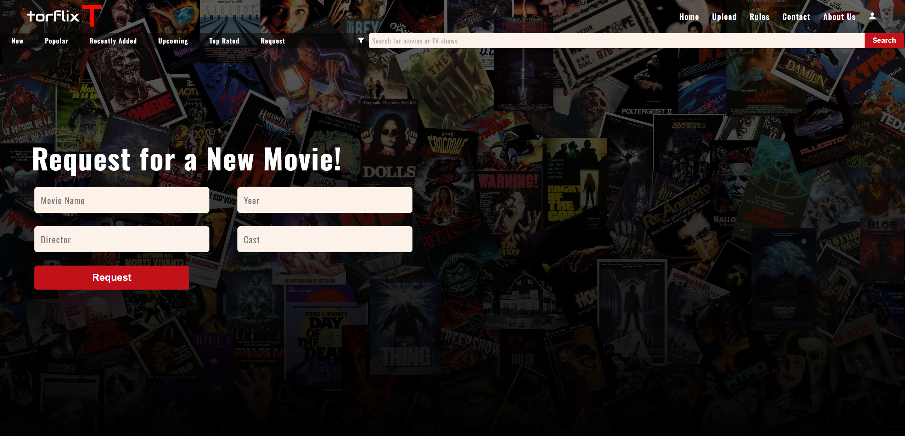

# 🎬 Torflix

Torflix is a simple **movie request service homepage** where users can suggest or request new movies.  
It is built using **HTML5** and **vanilla CSS**, focusing on a clean design, responsive layout, and beginner-friendly structure.

---

## 🚀 Features

- Modern and responsive homepage design
- Simple and minimal user interface
- Built entirely with HTML5 & CSS3 (no frameworks)
- Beginner-friendly code structure

---

## 🛠️ Tech Stack

- **HTML5** – Structure and content
- **CSS3** – Styling and layout

---

## 📂 Project Structure

torflix/
├── index.html
├── style.css
└── README.md

## 📸 Screenshots



## ⚡ Getting Started

To view the project locally:

1. Clone this repository
   ```bash
   git clone https://github.com/paulIndit25/Torflix-Movie-Request.git
   ```
